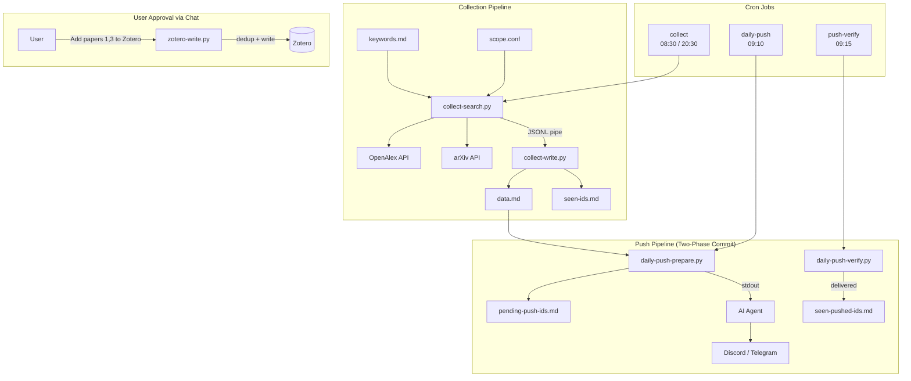

# Scholar Beacon

**English** | [中文](README_zh.md)

Automated academic literature discovery workflow for [OpenClaw](https://openclaw.ai) — search, collect, curate, and push scholarly papers via AI agent.

```
Cron Trigger → OpenAlex + arXiv Search → Dedup → data.md
                                                    ↓
                                          AI Agent formats daily digest
                                                    ↓
                                          Push to Discord / Telegram
                                                    ↓
                                          User reviews → Approve → Zotero
```

## Features

- **Multi-source search** — OpenAlex (250M+ papers) + arXiv, with configurable discipline filters
- **Smart dedup** — Local ID tracking + Zotero-aware duplicate detection
- **Human-in-the-loop Zotero curation** — Papers are collected automatically, but only enter your Zotero library after you approve them via chat
- **Two-phase push** — Prepare → verify delivery status, preventing lost state on push failures
- **AI-powered relevance review** — Agent judges paper relevance against your keywords and helps clean irrelevant results
- **6 companion Skills** — Manage keywords, search scope, Zotero approval, relevance review, and data cleanup through natural language chat
- **Configurable search scope** — OpenAlex concept filters + arXiv category restrictions, adjustable via chat

## Architecture



## Quick Start

### Prerequisites

- [OpenClaw](https://openclaw.ai) Gateway running
- [uv](https://github.com/astral-sh/uv) (Python package manager)
- [Zotero API Key](https://www.zotero.org/settings/keys) (optional, for library sync)

### Installation

```bash
# Clone
git clone https://github.com/hjnnjh/scholar-beacon.git
cd scholar-beacon

# Deploy scripts
mkdir -p ~/.openclaw/skills/literature-helper
cp scripts/*.py scripts/pyproject.toml ~/.openclaw/skills/literature-helper/
cp skills/literature-helper/SKILL.md ~/.openclaw/skills/literature-helper/

# Deploy companion skills
for skill in literature-keywords literature-zotero literature-review literature-cleanup literature-scope; do
  mkdir -p ~/.openclaw/skills/$skill
  cp skills/$skill/SKILL.md ~/.openclaw/skills/$skill/
done

# Create data directory
mkdir -p ~/.openclaw/workspace/literature
cp examples/keywords.md ~/.openclaw/workspace/literature/
cp examples/scope.conf ~/.openclaw/workspace/literature/

# Install Python dependencies
cd ~/.openclaw/skills/literature-helper
uv sync
```

### Configuration

#### 1. Zotero API (optional)

Add to `~/.openclaw/openclaw.json`:

```json5
{
  skills: {
    entries: {
      "literature-helper": {
        enabled: true,
        env: {
          "ZOTERO_API_KEY": "<your-key>",
          "ZOTERO_LIBRARY_ID": "<your-library-id>"
        }
      },
      "literature-zotero": {
        enabled: true,
        env: {
          "ZOTERO_API_KEY": "<your-key>",
          "ZOTERO_LIBRARY_ID": "<your-library-id>"
        }
      }
    }
  }
}
```

#### 2. Search Keywords

Edit `~/.openclaw/workspace/literature/keywords.md`:

```
# One keyword per line, # for comments
large language model recommendation
neural information retrieval
```

#### 3. Search Scope

Edit `~/.openclaw/workspace/literature/scope.conf`:

```
# OpenAlex discipline filter
openalex_filter = concepts.id:C41008148

# arXiv categories (comma-separated)
arxiv_categories = cs.IR, cs.AI, cs.LG, cs.CL
```

#### 4. Cron Jobs

See [`examples/cron-jobs.json`](examples/cron-jobs.json) for cron job templates. Add them to `~/.openclaw/cron/jobs.json` (requires stopping the Gateway first).

### Agent Installation

For a fully automated setup, send the prompt in [`INSTALL-PROMPT.md`](INSTALL-PROMPT.md) to your OpenClaw agent.

## Scripts

| Script | Purpose | I/O |
|--------|---------|-----|
| `collect-search.py` | Search OpenAlex + arXiv, filter seen IDs | keywords → stdout JSONL |
| `collect-write.py` | Pipe JSONL → append data.md + seen-ids.md | stdin JSONL → files |
| `zotero-write.py` | Write approved papers to Zotero (with dedup) | --ids → Zotero API |
| `daily-push-prepare.py` | Select unpushed papers → pending | data.md → stdout summary |
| `daily-push-verify.py` | Check delivery status → commit/discard | cron logs → files |
| `cleanup-irrelevant.py` | Remove papers by ID from data + seen files | --ids → files |

### Pipeline Usage

```bash
# Search and collect
uv run python3 collect-search.py \
  --keywords-file keywords.md \
  --seen-file seen-ids.md \
  --limit 20 \
| uv run python3 collect-write.py \
  --data-file data.md \
  --seen-file seen-ids.md

# Approve papers to Zotero
uv run python3 zotero-write.py \
  --data-file data.md \
  --ids "arxiv:2401.12345" "openalex:W1234567890"

# Clean irrelevant papers
uv run python3 cleanup-irrelevant.py \
  --data-file data.md \
  --seen-file seen-ids.md \
  --ids "openalex:W9999999999"
```

## Skills

Scholar Beacon includes 6 OpenClaw Skills for managing the workflow through natural language:

| Skill | Description | Example |
|-------|-------------|---------|
| `literature-helper` | Core collection + push scripts | _(used by cron jobs)_ |
| `literature-keywords` | Manage search keywords | "Add keyword: transformer architecture" |
| `literature-scope` | Configure search disciplines | "Add computer vision to search scope" |
| `literature-zotero` | Approve papers into Zotero | "Add papers 1, 3, 5 to Zotero" |
| `literature-review` | AI relevance review + cleanup | "Review recent papers for relevance" |
| `literature-cleanup` | Reset/clean data files | "Clean all literature data" |

## Data Files

All working data is stored in `~/.openclaw/workspace/literature/`:

| File | Purpose |
|------|---------|
| `keywords.md` | Search keywords (one per line) |
| `scope.conf` | Search scope configuration |
| `data.md` | Collected papers (Markdown table, by date) |
| `seen-ids.md` | Already-collected paper IDs |
| `seen-pushed-ids.md` | Already-pushed paper IDs |
| `pending-push-ids.md` | Pending push confirmation (two-phase) |
| `archive-YYYY-MM.md` | Monthly archives when data.md grows large |

## Design Decisions

- **Zotero writes require human approval** — Auto-collection fills your library with noise. Scholar Beacon collects broadly, but only writes to Zotero what you explicitly approve.
- **Two-phase commit for push** — If the messaging channel fails, paper IDs aren't marked as "pushed", so they retry next time.
- **OpenAlex over Semantic Scholar** — Free, no rate limits (with polite pool), 250M+ papers, better API design.
- **File-based state** — Simple `.md` files instead of a database. Easy to inspect, edit, and version control.
- **`lightContext: true`** — Cron jobs skip bootstrap context injection, reducing LLM token usage.

## License

MIT
