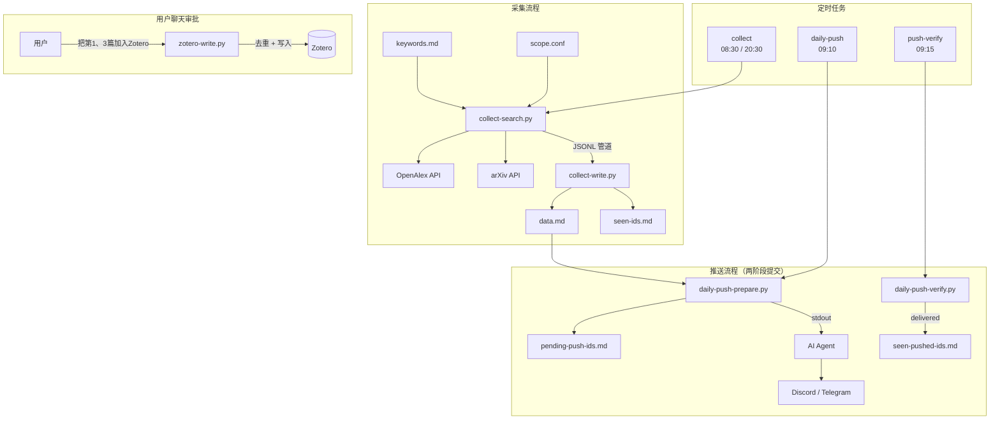

# Scholar Beacon

[English](README.md) | **中文**

基于 [OpenClaw](https://openclaw.ai) 的学术文献自动发现工作流 — 搜索、采集、筛选、推送，全程由 AI Agent 驱动。

```
定时触发 → OpenAlex + arXiv 搜索 → 去重 → data.md
                                                ↓
                                      AI Agent 格式化文献日报
                                                ↓
                                      推送到 Discord / Telegram
                                                ↓
                                      用户审阅 → 审批入库 → Zotero
```

## 特性

- **多源搜索** — OpenAlex（2.5 亿+ 论文）+ arXiv，可配置学科/类别过滤
- **智能去重** — 本地 ID 追踪 + Zotero 已有条目检测
- **人工审批入库** — 自动采集论文，但只有用户在聊天中确认后才写入 Zotero
- **两阶段推送** — prepare → verify 投递状态，推送失败不丢失状态
- **AI 相关性审查** — Agent 根据关键词判断论文相关性，辅助清理无关结果
- **6 个配套 Skill** — 通过自然语言管理关键词、搜索范围、Zotero 审批、相关性审查、数据清理
- **可配置搜索范围** — OpenAlex 学科过滤 + arXiv 类别限制，通过聊天调整

## 架构



## 快速开始

### 前置条件

- [OpenClaw](https://openclaw.ai) Gateway 已运行
- [uv](https://github.com/astral-sh/uv)（Python 包管理器）
- [Zotero API Key](https://www.zotero.org/settings/keys)（可选，用于文献库同步）

### 安装

```bash
# 克隆仓库
git clone https://github.com/hjnnjh/scholar-beacon.git
cd scholar-beacon

# 部署核心脚本
mkdir -p ~/.openclaw/skills/literature-helper
cp scripts/*.py scripts/pyproject.toml ~/.openclaw/skills/literature-helper/
cp skills/literature-helper/SKILL.md ~/.openclaw/skills/literature-helper/

# 部署配套 Skills
for skill in literature-keywords literature-zotero literature-review literature-cleanup literature-scope; do
  mkdir -p ~/.openclaw/skills/$skill
  cp skills/$skill/SKILL.md ~/.openclaw/skills/$skill/
done

# 创建数据目录
mkdir -p ~/.openclaw/workspace/literature
cp examples/keywords.md ~/.openclaw/workspace/literature/
cp examples/scope.conf ~/.openclaw/workspace/literature/

# 安装 Python 依赖
cd ~/.openclaw/skills/literature-helper
uv sync
```

### 配置

#### 1. Zotero API（可选）

在 `~/.openclaw/openclaw.json` 中添加：

```json5
{
  skills: {
    entries: {
      "literature-helper": {
        enabled: true,
        env: {
          "ZOTERO_API_KEY": "<你的密钥>",
          "ZOTERO_LIBRARY_ID": "<你的库ID>"
        }
      },
      "literature-zotero": {
        enabled: true,
        env: {
          "ZOTERO_API_KEY": "<你的密钥>",
          "ZOTERO_LIBRARY_ID": "<你的库ID>"
        }
      }
    }
  }
}
```

> Zotero API Key 从 https://www.zotero.org/settings/keys 获取，同一页面会显示你的 Library ID。

#### 2. 搜索关键词

编辑 `~/.openclaw/workspace/literature/keywords.md`：

```
# 每行一个关键词，# 开头为注释
large language model recommendation
neural information retrieval
```

建议使用英文关键词（OpenAlex 和 arXiv 英文搜索效果最好）。

#### 3. 搜索范围

编辑 `~/.openclaw/workspace/literature/scope.conf`：

```
# OpenAlex 学科过滤（留空不限制）
openalex_filter = concepts.id:C41008148

# arXiv 类别限制（逗号分隔，留空搜索全站）
arxiv_categories = cs.IR, cs.AI, cs.LG, cs.CL
```

<details>
<summary>常用 OpenAlex 学科 ID</summary>

| 学科 | Concept ID |
|------|-----------|
| Computer Science | `C41008148` |
| Mathematics | `C33923547` |
| Physics | `C121332964` |
| Engineering | `C127413603` |
| Biology | `C86803240` |
| Medicine | `C71924100` |
| Economics | `C162324750` |

多学科用 `\|` 分隔：`concepts.id:C41008148\|concepts.id:C33923547`

</details>

<details>
<summary>常用 arXiv CS 类别</summary>

| 类别 | 说明 |
|------|------|
| `cs.IR` | 信息检索 |
| `cs.AI` | 人工智能 |
| `cs.LG` | 机器学习 |
| `cs.CL` | 自然语言处理 |
| `cs.CV` | 计算机视觉 |
| `cs.SE` | 软件工程 |
| `cs.DB` | 数据库 |
| `stat.ML` | 统计机器学习 |

</details>

#### 4. 推送渠道

Scholar Beacon 支持 **Discord** 和 **Telegram** 两种推送渠道。在每个 cron job 的 delivery 字段中配置：

| 渠道 | `delivery.channel` | `delivery.to` |
|------|-------------------|---------------|
| Discord | `"discord"` | 频道 ID（右键频道 → 复制频道 ID） |
| Telegram | `"telegram"` | Chat ID |

如果使用 Discord，需确保目标频道在 `openclaw.json` 的 guild allowlist 中（`channels.discord.guilds.<guild_id>.channels.<channel_id>.allow: true`）。

#### 5. 定时任务

参考 [`examples/cron-jobs.json`](examples/cron-jobs.json) 中的模板，将 `<CHANNEL>` 和 `<TARGET_ID>` 替换为你的推送渠道配置，然后添加到 `~/.openclaw/cron/jobs.json`（需先停止 Gateway）。

### Agent 一键安装

将 [`INSTALL-PROMPT.md`](INSTALL-PROMPT.md) 中的 prompt 发送给你的 OpenClaw Agent，即可自动完成安装部署。

## 脚本说明

| 脚本 | 功能 | 输入/输出 |
|------|------|----------|
| `collect-search.py` | 搜索 OpenAlex + arXiv，过滤已见 ID | 关键词 → stdout JSONL |
| `collect-write.py` | 管道接收 JSONL → 追加 data.md + seen-ids | stdin JSONL → 文件 |
| `zotero-write.py` | 按 ID 将审批通过的论文写入 Zotero（自动去重） | --ids → Zotero API |
| `daily-push-prepare.py` | 筛选未推送论文 → pending | data.md → stdout 摘要 |
| `daily-push-verify.py` | 检查投递状态 → commit/discard | cron 日志 → 文件 |
| `cleanup-irrelevant.py` | 按 ID 从 data.md 和 seen-ids 中移除论文 | --ids → 文件 |

### 管道用法

```bash
# 搜索并采集
uv run python3 collect-search.py \
  --keywords-file keywords.md \
  --seen-file seen-ids.md \
  --limit 20 \
| uv run python3 collect-write.py \
  --data-file data.md \
  --seen-file seen-ids.md

# 审批入库 Zotero
uv run python3 zotero-write.py \
  --data-file data.md \
  --ids "arxiv:2401.12345" "openalex:W1234567890"

# 清理无关论文
uv run python3 cleanup-irrelevant.py \
  --data-file data.md \
  --seen-file seen-ids.md \
  --ids "openalex:W9999999999"
```

## Skills 一览

Scholar Beacon 包含 6 个 OpenClaw Skill，支持通过自然语言管理整个工作流：

| Skill | 功能 | 示例指令 |
|-------|------|----------|
| `literature-helper` | 核心采集+推送脚本 | _（定时任务使用）_ |
| `literature-keywords` | 管理搜索关键词 | "添加关键词：transformer architecture" |
| `literature-scope` | 配置搜索学科范围 | "搜索范围加上计算机视觉" |
| `literature-zotero` | 审批论文入库 Zotero | "把第 1、3、5 篇加入 Zotero" |
| `literature-review` | AI 相关性审查+清理 | "审查一下最近的论文" |
| `literature-cleanup` | 重置/清理数据文件 | "清理所有文献数据" |

## 数据文件

所有工作数据位于 `~/.openclaw/workspace/literature/`：

| 文件 | 说明 |
|------|------|
| `keywords.md` | 搜索关键词（每行一个） |
| `scope.conf` | 搜索范围配置 |
| `data.md` | 采集数据（Markdown 表格，按日期分节） |
| `seen-ids.md` | 已采集论文 ID |
| `seen-pushed-ids.md` | 已推送论文 ID |
| `pending-push-ids.md` | 待确认推送 ID（两阶段中间态） |
| `archive-YYYY-MM.md` | data.md 超限后的月度归档 |

## 设计决策

- **Zotero 写入需人工审批** — 自动采集会给文献库引入噪音。Scholar Beacon 广泛采集，但只有用户明确审批的论文才写入 Zotero。
- **两阶段提交推送** — 消息投递失败时，论文 ID 不会被标记为"已推送"，下次会重试。
- **OpenAlex 替代 Semantic Scholar** — 免费、无速率限制（polite pool）、2.5 亿+ 论文、API 设计更好。
- **文件状态管理** — 使用简单的 `.md` 文件而非数据库。便于查看、编辑和版本控制。
- **`lightContext: true`** — 定时任务跳过 bootstrap 上下文注入，减少 LLM token 消耗。

## 许可证

MIT
